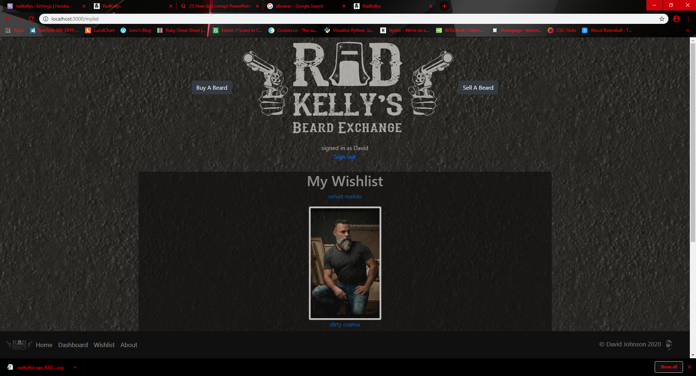

# RAD KELLYS
	R7:
    Identification of the problem you are trying to solve by building this particular marketplace app.


Why can't Some men grow beards?

Dr. Jennifer Chwalek explains:

"It's based on genetics as well as hormones. Some men, you know, have more hair follicles, so they can grow denser, coarser beards than others. Testosterone gets converted in the hair follicle to a more potent form called dihydrotestosterone."

There are many problems that surround the growing of beards in this modern day:

- Some men can cultivate amazing beards, and other men can’t.  This leaves them feeling inferior and somewhat lacking.  

- Some men are time precious – and don’t have the time to sit around growing beards.

- Some men would like the freedom to play around with different styles and textures.

- Some men are gingers and the beards they yield are sub-par in comparison to their non-ginger counterparts.

- Women often miss out on the chance to own and cultivate beards

With proper techniques, hair can be preserved forever.  With the right technology it can now be exchanged between peers accross the world. 

This marketplace is designed to allow beard cultivators to sell their wares to the folically challenged so everyone can enjoy the glory of beard ownership.

	R8:
    Why is it a problem that needs solving?

In a world where we have abundant choice of so many things, it’s a real problem that incidental things like genetics, ethnicity and hormone levels can have such a profound effect on the ability to grow a beard. 

 People deserve the right to choose what they do with their own bodies and finally, thank god, there’s a system in place to allow those choices to be made. 
 
 Men and women deserve the freedom to buy, swap and sell their beards in the free market.  

ANSWER

	R9:
    A link (URL) to your deployed app (i.e. website)
    

https://radkellys.herokuapp.com/

	R10:
    A link to your GitHub repository (repo).Ensure the repo is accessible by your Educators

The main repo I used to build the app was

https://github.com/davidjono1985/marketplace-app

I had to create a new one to deploy to heroku and made some minor changes

https://github.com/davidjono1985/rad-kellys

    
	R11:
    Description of your marketplace app (website), including:
    Purpose
    Functionality / features
    Sitemap 
    Screenshots 
    Target audience 
    Tech stack (e.g. html, css, deployment platform, etc)

PURPOSE: The purpose of the app is to facillitate the connection between beard growers, and those who would like to purchase a beard.  I believe the market is currently untapped and the total addressable market is at least 50% of the population.  Using simple processes for beard extraction, and utilizing Australia Post for delivery, every buyer can have a freshly harvested beard delivered to them in a matter of days.

FUNCTIONALITY/FEATURES:  

This applicaiton offers a two-way marketplace where a user can sign up, and choose whether they want to browse beards for sale, or alternately buy one of their own.

A user signs up and is directed straight to the list of potential beards to buy.  From here they can navigate using a handy navigation bar located at the bottom of the screen.

While browsing beards, the user can add beards of their choice to their own personalised wishlist where they can then return and buy at a later date.  Alternately if they are more of an impulse buyer, they can elect to purchase it then and there.  All previous purchases also display on the wishlist platform.

For the beard sellers, they can easily navigate directly to the dashboard which allows them to track and manage their offerings. Its a simple process of inputting details about the beard and uploading a photo.  Once the beard is purchased, they are notified and can start the process of getting that beard to the intendeed recipient.

The site is easy to navigate, user friendly and contains a lot of great functionality.  There will be future enhancements, but for an MVP this satisfies all of the requirements outlined by the user stories. 
 

FUNCTIONALITY/FIEATURES: 


Sitemap: 


Screenshots:




The Target audience for buyers is men of all ages who lack the ability to grow, cultivate and harvest their own facial hair.  For sellers it is exactly the opposite - those with the hair to spare. The secondary market are buyers in the arts space - people who need real human hair for acting roles, whether cinema, theatre or pantomime. 


The tech stack includes:

-Ruby on Rails
-HTML
-SCSS (Including Bulma for some styling)
-Javascript for Stripe checkout
-Postgresql
-Heroku for deployment
-AWS for photo upload
-Stripe for payment processing
-Git/Github for source control


sdfdf

	R12:
    User stories for your app


</br>
User Stories


DELIVERY/COST: As a buyer I would like to know my distance from the seller and work out cost of delivering item through registered post
    
USER RATING: As a buyer/seller I want to rate other users so I can provide feedback on the transaction

COMPANY INFO: As a new/returning user I would like to view information on the company who/what/how so that I can grow trust in the process
    
TESTIMONIALS: As a new/returning user I want to view the testimonials of previous buyers/sellers so I can gain trust in the application
    
MARKETPLACE LANDING: As a buyer/seller I want to be able to use the platform to buy/sell goods

USER CHOICE - BUYER: As a new/returning user, I want to enter the platform as a buyer so that all of my options and settings relate to purchasing an item


USER CHOICE - SELLER: As a new/returning user, I want to enter the platform as a seller so that all of my options and settings relate to selling my item
    
    
BUYER DETAILS: As a buyer I want to register my personal information so I can receive my purchased items
    
    
USER SIGN-UP/LOGIN: As a new user, I want to sign up to the application so that I can use the service.  As a returning user, I want to log in to the applicaiton so that I can use the service
    
    
ITEM DETAILS: As a seller, I want to input my item's details so I can sell it to another user
    
    
SELL ITEMS: As a new/returning user, I want to post my item online so that I can make money off its sale


	R13:
    Wireframes for your app


</br>
Please see PDF wireframes in docs folder


	R14:
    An ERD for your app
    
</br>
ERD of relational database


	R15:
    Explain the different high-level components (abstractions) in your app
    

The app has the following MVC components:

**VIEWS:**

The Devise folder - views to do with user authentication, from the devise gem, such as log in and new user pages.


items folder: views associated with the items, such as creating a new item, reading, updating and destroying.

layouts folder: this is the main (default) template for the applicaiton

orders folder: this is for views do do with selling and buying items

pages folder: this is for all the static pages like "landing" and "about"

shared folder: in this template there are partials for the header and footer that appears on every page.

**CONTROLLERS:**

application controller: usually holds functions for the entire application. In this instance it has been used for permissions for the Devise gem.

items controller - this controller has methods to create views based on the items, as well as methods for destroying, creating and updating items.  Also for adding/removing from the wishilst

orders controller - holds methods for buying items.

pages controller - this one holds mostly empty methods as these pages are static and dont require data.

**MODELS:**

ITEM: The Item model sets the attributes for Item 
- belongs_to :user
- has_many :orders
- has_many :wishlists
- has_one_attached :picture
  

ORDER: The Order model sets the attributes for order - belongs to user and belongs to item

USER: The User model is generated as part of Devise, the gem for handling user logins.  It validates that the username is present and unique, and a function that gets the username from the database. 

WISHLIST: The wishlist model sets the attributes for wishilist - belongs to user and belongs to item.


	R16:
    Detail any third party services that your app will use
    

The app uses two main third party services:


Stripe - Credit card details should never be stored so companies like Stripe allow businesses and individuals to make and receive payments securely over teh internet.

In the currently application when you click "Buy Now" it takes you to the Stripe site where the payment is certified and paid and the information is then sent back to the app via a webhook.

Amazon Web Services S3 - Bucket is used for Active storage so users can upload photo's of their items.  This is also a free service. You simply create an account and connect it to the application.


Heroku - Which is a cloud platform service where websites can be deployed for free.  

The main steps for deploying using Heroku are as follows:
- Create an account and connect using CLI
- Send the master key to the application
- Push to the Heroku repository
- Set up the database

The application also uses Google Fonts and Bootstrap


	R17:
    Describe your projects models in terms of the relationships (active record associations) they have with each other
    
This application has four models, Item, User Order and Wishlist

A User can be both a Buyer and a Seller, and may not have any Items.  It has many orders, has many items and has many wishlists.

he Item model belongs to the User, and a User has many Items. The Item model also has many wishlists and has one picture attached.

The Order model and the Wishlist models belongs to both the Item and User models 


	R18:
    Discuss the database relations to be implemented in your application
    

As you can see in the ERD above, this is a relational database eg. the information in one table relates to information in other tables.

When considering database design, its best practice to make sure each piece of information is in the database only once. This also ensures the data is as accurate as possible.

If you take for instance the Items model, all that was needed was to incorporate the User ID as a foreign key and through this the sellers information can be accessed.

There are also join tables for Orders and Wishlist which connects the Items to Users 

In future releases, there will also be the review database connected to the user which will allow users to rate each other.


	R19:
    Provide your database schema design
    

Here are the database schemas

ACTIVE STORAGE: 

 create_table "active_storage_attachments", force: :cascade do |t|
- t.string "name", null: false
- t.string "record_type", null: false
- t.bigint "record_id", null: false
- t.bigint "blob_id", null: false
- t.datetime "created_at", null: false
- t.index ["blob_id"], name: "index_active_storage_attachments_on_blob_id"
- t.index ["record_type", "record_id", "name", "blob_id"], name: - -    "index_active_storage_attachments_uniqueness", unique: true
  

  create_table "active_storage_blobs", force: :cascade do |t|
- t.string "key", null: false
- t.string "filename", null: false
- t.string "content_type"
- t.text "metadata"
- t.bigint "byte_size", null: false
- t.string "checksum", null: false
- t.datetime "created_at", null: false
- t.index ["key"], name: "index_active_storage_blobs_on_key", unique: true
  


  create_table "items", force: :cascade do |t|
- t.string "name"
- t.string "category"
- t.string "colour"
- t.string "texture"
- t.integer "days_to_cultivate"
- t.decimal "price", precision: 5, scale: 2
- t.bigint "user_id", null: false
- t.datetime "created_at", precision: 6, null: false
- t.datetime "updated_at", precision: 6, null: false
- t.boolean "sold"
- t.index ["user_id"], name: "index_items_on_user_id"
  end


  create_table "orders", force: :cascade do |t|
- t.bigint "user_id", null: false
- t.bigint "item_id", null: false
- t.datetime "created_at", precision: 6, null: false
- t.datetime "updated_at", precision: 6, null: false
- t.index ["item_id"], name: "index_orders_on_item_id"
- t.index ["user_id"], name: "index_orders_on_user_id"


USERS:

  create_table "users", force: :cascade do |t|
- t.string "email", default: "", null: false
- t.string "encrypted_password", default: "", null: false
- t.string "reset_password_token"
- t.datetime "reset_password_sent_at"
- t.datetime "remember_created_at"
- t.string "first_name"
- t.string "last_name"
- t.string "address"
- t.integer "phone"
- t.boolean "admin"
- t.datetime "created_at", precision: 6, null: false
- t.datetime "updated_at", precision: 6, null: false
- t.index ["email"], name: "index_users_on_email", unique: true
- t.index ["reset_password_token"], name: "index_users_on_reset_password_token", unique: true


WISHLISTS:

  create_table "wishlists", force: :cascade do |t|
- t.bigint "user_id", null: false
- t.bigint "item_id", null: false
- t.datetime "created_at", precision: 6, null: false
- t.datetime "updated_at", precision: 6, null: false
- t.index ["item_id"], name: "index_wishlists_on_item_id"
- t.index ["user_id"], name: "index_wishlists_on_user_id"


FOREIGN KEYS:

- add_foreign_key "active_storage_attachments", "active_storage_blobs", column: "blob_id"
- add_foreign_key "items", "users"
- add_foreign_key "orders", "items"
- add_foreign_key "orders", "users"
- add_foreign_key "wishlists", "items"
- add_foreign_key "wishlists", "users"


```
	R20:
    Describe the way tasks are allocated and tracked in your project

```

</br>
Trello board

A trello board was utilized to allocate and track tasks in the project.  Once the user stories were established, this was transferred to the board and then each story was broken down into the individual tasks.

There were four main columns on the board

TO DO - User stories.  This was the to do list for pertinent parts of the MVP and had priority focus compared to the other To do list.

TO DO - Sprinkles was the column I created for all of the extra features I would like to incorporate into the application.  These were less important and could easily be not included in the MVP if time did not permit.

DOING - is all of the times currently being worked on

DONE - is the list of all completed tasks relating to the user stories. 